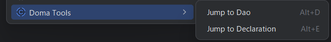
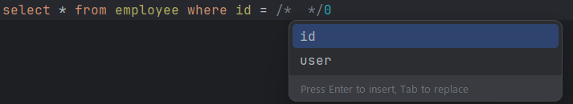
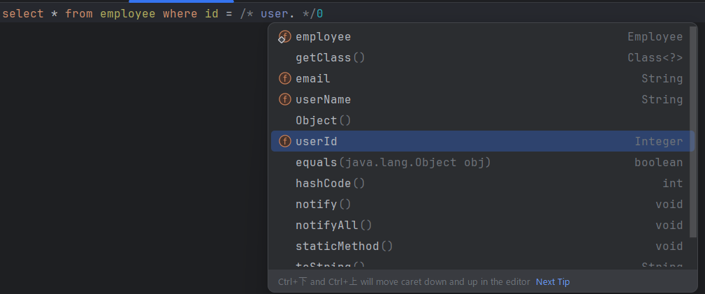

# Doma Tools for IntelliJ

<!-- Plugin description -->
“Doma Tools” is a plugin that supports the development of [Doma](https://github.com/domaframework/doma) based projects in IntelliJ.

It checks associations between Dao and SQL, and offers coding support features for Doma syntax,
such as generating SQL template files, navigating between files, and inspections to ensure the validity of bind variables.

<!-- Plugin description end -->

# Features

## Actions
The plugin adds some actions, gutter icons.
Shortcut keys can be used for actions

- **Jump to SQL**
  - Jump to action from Dao to SQL
  - You can also jump to the SQL file from the gutter icon that is displayed together.
- **Generate SQL**
  - Generate SQL file
- **Jump to Dao**
  - Jump to action from SQL to Dao
  - You can also jump to the Dao Method from the gutter icon that is displayed together.

## Inspection
Check that bind variables are used appropriately for Dao and SQL associations.
The plugin also provides quick fixes for Dao methods where the required SQL files do not exist.

- Quick fix for missing SQL template file
  
- Checking for Dao method arguments not used in bind variables
  

## Completion
Adds code completion functionality to support indexing of Doma directives and bind variables

- Suggest Dao method arguments in bind variable directives
  
- Refer to class definition from Dao method argument type and suggest fields and methods
  
- Suggest members defined as static in static fields and method calls
- Suggest Doma directives
- Directives such as Condition, Loop, Population are suggested after “%”
- Suggest built-in functions after “@”

## Refactoring
Along with the Dao name change, we will refactor the SQL file directory and file name.

- After refactoring the Dao name, change the SQL deployment directory name as well.
- After refactoring the Dao method name, we will also change the SQL file name.
- After refactoring the Dao package, we will also change the SQL directory.

## Formatter(Preview)
Provides code formatting for SQL syntax.

This feature is in preview. You cannot customize the indentation or keywords to be broken down!

You can reformat entire directories and files with "Code > Reformat Code".

If you want to enable the plugin's formatting function, check "Enable SQL Format" in "Settings > Other Settings > Doma Tools". (The default is OFF.)
## Settings
Some functions of "Doma Tools" can be customized from the settings screen.

- Enabling/disabling inspections and customizing error levels
- Highlight color settings for SQL elements

- Customize action shortcut keys
