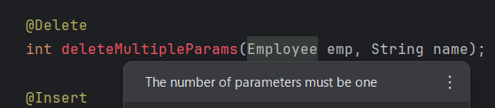

# Doma Tools for IntelliJ
[](https://plugins.jetbrains.com/plugin/26701-doma-tools)
[](https://github.com/domaframework/doma-tools-for-intellij/actions/workflows/build.yml)
[](https://github.com/domaframework/doma-tools-for-intellij/actions/workflows/release.yml)

<!-- Plugin description -->
"Doma Tools" is a plugin that supports the development of [Doma](https://github.com/domaframework/doma) based projects in IntelliJ.

"Doma Tools" supports development using both Doma 2 and Doma 3.

It checks associations between DAO and SQL and offers coding support features for Doma syntax,
such as generating SQL template files, navigating between files, and inspecting the validity of bind variables.

<!-- Plugin description end -->

# Features

## Actions
The plugin adds several actions and gutter icons.
Shortcut keys can be used for these actions.


- **Jump to SQL**
  - Jump from DAO to SQL.
  - You can also jump to the SQL file using the gutter icon displayed alongside.
- **Generate SQL**
  - Generate an SQL file.
- **Jump to DAO**
  - Jump from SQL to DAO.
  - You can also jump to the DAO method using the gutter icon displayed alongside.

## Inspection
Checks that bind variables are used appropriately for DAO and SQL associations.
The plugin also provides quick fixes for DAO methods where the required SQL files do not exist.

- Quick fix to generate SQL template file.
  
- Checks for unused DAO method arguments.
  
- Checks that the return type of DAO method matches the expected type based on its annotation.
  
- Checks that parameters of DAO method matches the expected type based on its annotation.
  
- Checks for undefined bind variable names.
- Checks the class name and package name for static property calls.
  
- Optional types are recognized as their element type (e.g., a parameter of type `Optional<String>` is treated as type `String`).
- For custom functions, checks for methods that are not defined in the configured ExpressionFunctions implementation class.


## Completion
Code completion is available to assist you in coding within directives.

- Suggests DAO method arguments in bind variable directives.
  
- Analyzes DAO method argument types and suggests instance fields and methods.
- Suggests package and class names for class names used in static property calls.
  
- Suggests members defined as static in static fields and method calls.
- Directives such as Condition, Loop, and Population are suggested after `%`.
- Suggests built-in and custom functions after `@`.
- Optional types are recognized as their element type (e.g., a parameter of type `Optional<String>` is treated as type `String`).

## Refactoring
Along with DAO changes, the plugin will refactor the SQL file directory and file name.

- After refactoring the DAO name, the SQL directory name will also be updated.
- After refactoring the DAO method name, the SQL file name will also be updated.
- After refactoring the DAO package, the SQL directory will also be updated.


## Formatter
Provides code formatting for SQL syntax.
This feature is in preview. You cannot customize the indentation or keywords to be broken down!

The formatter works with both SQL files and SQL text blocks within `@Sql` annotations in DAO methods.

Automatic indentation on newlines provided by the SQL formatting feature is disabled by default.

To enable auto-indentation, toggle the corresponding flag in the settings screen below.

`Settings > Other Settings > Doma Tools > Enable auto-indent for SQL`


### Limitations
The current formatter has the following limitations:

- **No customizable indentation**: The number of spaces for indentation is fixed and cannot be changed
- **No customizable line breaks**: You cannot configure which keywords trigger line breaks
- **No custom function registration**: User-defined functions cannot be registered for formatting rules
- **No formatting style options**: Cannot choose between different formatting styles or conventions

### Formatting Features
The SQL formatter supports the following formatting capabilities:

- **SQL Keywords**: Converts keywords to uppercase (SELECT, FROM, WHERE, INSERT, UPDATE, DELETE, etc.)
- **Statement Structure**: Properly formats different SQL statement types:
  - SELECT statements with proper column and clause alignment
  - INSERT statements with formatted column lists and VALUES clauses
  - UPDATE statements with aligned SET clauses
  - DELETE statements with formatted conditions
  - WITH clauses (CTE) with proper indentation
- **Joins**: Formats JOIN operations with appropriate indentation and alignment
- **Subqueries**: Properly indents nested queries and subselects
- **Functions**: Formats function calls with proper parameter alignment
- **Comments**: Preserves single-line (--) and multi-line (/* */) comments
- **Doma Directives**: Maintains proper formatting for Doma-specific directives:
  - Bind variables: `/* paramName */` with proper spacing
  - Conditional directives: `/*%if condition */` ... `/*%end*/`
  - Loop directives: `/*%for item : collection */` ... `/*%end*/`
  - Expand directive: `/*%expand */`
  - Populate directive: `/*%populate */`
  - Static property calls: `/* @ClassName@property */`
  - Literal values: `/*^ literalValue */`
  - Embedded variables: `/*# variable */`

### Examples

**Before formatting:**
```sql
SELECT COUNT(DISTINCT x) AS count_x, o.*, COALESCE(nbor.nearest, 999)
AS nearest FROM ( SELECT p.objid, p.psfmag_g - p.extinction_g AS rpm
FROM phototag p JOIN usno u ON p.objid = u.objid
WHERE p.TYPE = 'Star' /*%if status == 2 */ and u.propermotion > 2.0 /*%end*/ ) as o
```

**After formatting:**
```sql
SELECT COUNT(DISTINCT x) AS count_x
       , o.*
       , COALESCE(nbor.nearest
                  , 999) AS nearest
  FROM ( SELECT p.objid
                , p.psfmag_g - p.extinction_g AS rpm
           FROM phototag p
                JOIN usno u
                  ON p.objid = u.objid
          WHERE p.TYPE = 'Star'
            /*%if status == 2 */
            AND u.propermotion > 2.0
            /*%end*/ ) AS o
```

## Reference Contributor
Ctrl+Click on a bind variable in an SQL file to jump to its source symbol.

This feature works in source JARs as well, but in binary JARs, if the DAO method’s argument parameter names have been changed, the references cannot be resolved and the feature will not function.

- The DAO method’s argument parameter definition.
- The field and method definitions on that parameter’s type.
- The class definition referenced by @ClassName@.
- Custom functions in the configured ExpressionFunctions implementation class.
- You can also jump using the **Go To > Declaration Usage** menu.


## Settings
Some functions of "Doma Tools" can be customized from the settings screen.

- Enable/disable inspections and customize error levels.
- Highlight color settings for SQL elements.

- Customize action shortcut keys.
- Enable/disable automatic indentation when breaking SQL lines.

**If you want to use custom functions defined in your own ExpressionFunctions implementation class,
place a `doma.compile.config` file directly under the resources directory and specify the `doma.expr.functions` entry.**

[Doma Setting Options with Configuration File](https://doma.readthedocs.io/en/stable/annotation-processing/#setting-options-with-configuration-file)

Example: doma.compile.config
```properties
doma.expr.functions=example.expression.MyExpressionFunctions
```

The contents of `doma.compile.config` are cached.
The cache is updated based on the file's last modified timestamp, so please make sure to save the file after making any changes.
**Autosave may not update the cache.**
