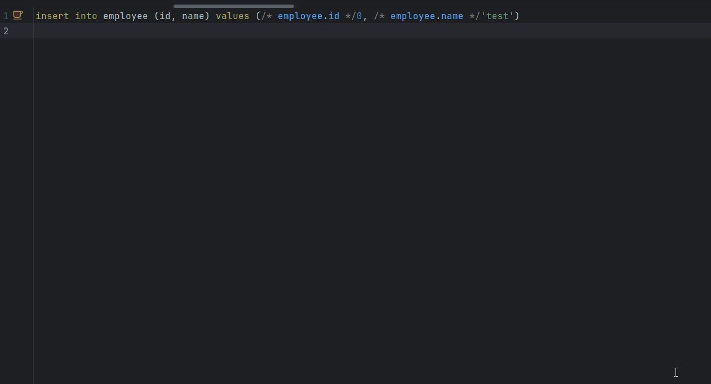

# Doma Tools for IntelliJ
[](https://plugins.jetbrains.com/plugin/26701-doma-tools)
[](https://github.com/domaframework/doma-tools-for-intellij/actions/workflows/build.yml)
[](https://github.com/domaframework/doma-tools-for-intellij/actions/workflows/release.yml)

<!-- Plugin description -->
"Doma Tools" is a plugin that supports the development of [Doma](https://github.com/domaframework/doma) based projects in IntelliJ.

It checks associations between DAO and SQL, and offers coding support features for Doma syntax,
such as generating SQL template files, navigating between files, and inspections to ensure the validity of bind variables.

<!-- Plugin description end -->

# Features

## Actions
The plugin adds some actions, gutter icons.
Shortcut keys can be used for actions


- **Jump to SQL**
  - Jump to from DAO to SQL
  - You can also jump to the SQL file from the gutter icon that is displayed together.
- **Generate SQL**
  - Generate SQL file
- **Jump to DAO**
  - Jump to from SQL to DAO
  - You can also jump to the DAO Method from the gutter icon that is displayed together.

## Inspection
Check that bind variables are used appropriately for DAO and SQL associations.
The plugin also provides quick fixes for DAO methods where the required SQL files do not exist.

- Quick fix for generate SQL template file.
  
- Checking for DAO method arguments not used.
  
- Check for undefined bind variable names.
- Check the class name and package name for static property calls.
  
- Optional types are recognized as their element type (e.g. a parameter of type `Optional<String>` is treated as type `String`).
- For custom functions, checks for methods that are not defined in the configured ExpressionFunctions implementation class.

## Completion
Code completion is available to assist you in coding within the directives.

- Suggest DAO method arguments in bind variable directives.
  
- It looks at DAO method argument types and suggests instance fields, methods.
- Suggests package and class names for class names used in static property calls.
  
- Suggest members defined as static in static fields and method calls.
- Directives such as Condition, Loop, Population are suggested after `%`.
- Suggests built-in and custom functions after `@`.
- Optional types are recognized as their element type (e.g. a parameter of type `Optional<String>` is treated as type `String`).

## Refactoring
Along with the DAO change, we will refactor the SQL file directory and file name.

- After refactoring the DAO name, change the SQL directory name as well.
- After refactoring the DAO method name, we will also change the SQL file name.
- After refactoring the DAO package, we will also change the SQL directory.


## Formatter(Preview)
Provides code formatting for SQL syntax.
This feature is in preview. You cannot customize the indentation or keywords to be broken down!

Automatic indentation on newlines provided by the SQL formatting feature is disabled by default.

To enable auto-indentation, toggle the corresponding flag in the settings screen below.

`Settings > Other Settings > Doma Tools > Enable auto-indent for SQL`



## Reference resolution
Ctrl+Click on a bind variable in an SQL file to jump to its source symbol:

This feature works in source JARs as well, but in binary JARs, if the DAO method’s argument parameter names have been changed, the references cannot be resolved and the feature will not function.

- The DAO method’s argument parameter definition
- The field and method definitions on that parameter’s type
- The class definition referenced by @ClassName@
- Custom functions in the configured ExpressionFunctions implementation class
- You can also jump using the **Go To > Declaration Usage** menu.


## Settings
Some functions of "Doma Tools" can be customized from the settings screen.

- Enabling/disabling inspections and customizing error levels
- Highlight color settings for SQL elements

- Customize action shortcut keys
- Enable/disable automatic indentation when breaking SQL lines

**If you want to use custom functions defined in your own ExpressionFunctions implementation class,
place a `doma.compile.config` file directly under the resources directory and describe the `doma.expr.functions` entry.**

[Doma Setting Options with Configuration File](https://doma.readthedocs.io/en/stable/annotation-processing/#setting-options-with-configuration-file)

ex) doma.compile.config
```properties
doma.expr.functions=example.expression.MyExpressionFunctions
```

The contents of `doma.compile.config` are cached.
The cache is updated based on the file's last modified timestamp, so please make sure to save the file after making any changes.
**Autosave may not update the cache.**
