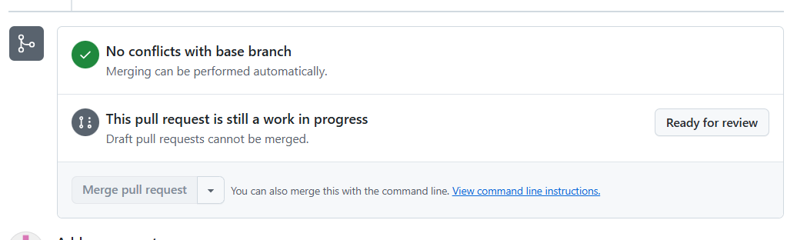
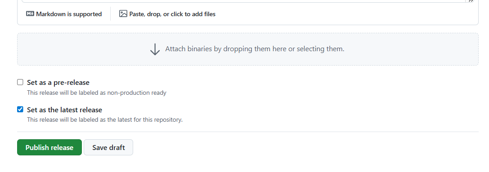

# Release Operations for Doma Tools for IntelliJ

This document describes the steps required to perform a release.

## Overview

The release process for this project is automated and consists of several stages, all managed on GitHub:

1. **Automatic Changelog and Release Draft Updates**
   - Every time a pull request (PR) is merged into `main`, GitHub Actions automatically updates `CHANGELOG.md` and the release draft.
   - A working branch named `doc/changelog-update-x.x.x` is created for updating `CHANGELOG.md`, and a draft pull request titled `Changelog update - x.x.x` is opened.
   - This pull request is force-pushed and updated with each new PR merged into `main`, reflecting the latest changes and release version.

2. **Release Note Publication and Marketplace Upload**
   - When a release note is published on GitHub, the [GitHub Actions workflow `release`](.github/workflows/release.yml) is triggered.
   - This workflow automatically uploads the latest version to the JetBrains Marketplace.

For other instructions on the Marketplace, please refer to the [official documentation](https://plugins.jetbrains.com/docs/marketplace/publishing-and-listing-your-plugin.html)

## Files Updated for Version Changes

Every time a pull request (PR) is merged into `main`, the following files are updated automatically:

- [`PluginUtil.kt`](src/main/kotlin/org/domaframework/doma/intellij/common/util/PluginUtil.kt)
- [`logback.xml`](src/main/resources/logback.xml)
- [`logback-test.xml`](src/main/resources/logback-test.xml)
- [`gradle.properties`](gradle.properties)

## Release Procedure

1. **Confirm all required PRs are merged into `main`.**
2. **Check the contents of [CHANGELOG.md](CHANGELOG.md) and the GitHub release draft**
   - Ensure that all necessary PRs are listed in both the updated `CHANGELOG.md` (from the draft pull request `Changelog update - x.x.x`) and the GitHub release draft.
   - Note: Documentation update PRs are not included in `CHANGELOG.md`.
3. **Mark the draft pull request `Changelog update - x.x.x` as "Ready for Review"**
   - If the build action passes, merge the pull request.
   
4. **Publish the release on GitHub**
   - Open the release draft at [GitHub Releases](https://github.com/domaframework/doma-tools-for-intellij/releases).
   - Check "Set as the latest release" and click "Publish Release".
   
5. **After the [release action](.github/workflows/release.yml) completes, confirm the latest version is available on the JetBrains Marketplace.**
6. **After the release, a draft for the next pre-release version is automatically created, and a commit is made to the `main` branch to set the next pre-release version.**

## Manual Release Procedure (if GitHub Actions fails)

If there is a problem with GitHub Actions and the automatic release fails, follow the steps below to perform a manual release:

1. Pull the latest changes to ensure your local `main` branch is up to date.
2. Confirm that the version in each file matches the intended release version.
   - Files to check:
     - `PluginUtil.kt`
     - `logback.xml`
     - `logback-test.xml`
     - `gradle.properties`
3. Run the Gradle task `buildPlugin` to build the plugin. ``` ./gradlew buildPlugin```
4. Upload the generated zip file`build/distributions` from the JetBrains Marketplace management screen.
   - generated zip file: `build/distributions/Doma Tools for IntelliJ-x.x.x.zip`

---
